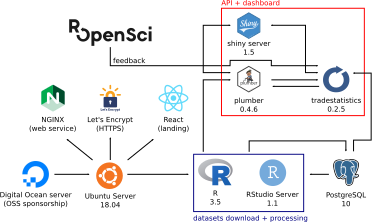
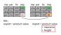
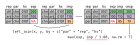
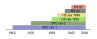

---
output:
  xaringan::moon_reader:
    css: ["assets/metropolis.min.css", "assets/metropolis-fonts.min.css", "assets/fontawesome-all.min.css",
    "assets/part-slide.min.css", "assets/my-theme.min.css"]
    lib_dir: libs
    nature:
      ratio: "4:3"
      highlightStyle: github
      highlightLines: true
      countIncrementalSlides: false
---

```{r setup, include=FALSE}
options(htmltools.dir.version = FALSE)

knitr::opts_chunk$set(echo = TRUE, cache = TRUE,
                      fig.align = 'center',
                      fig.width = 15, message = FALSE)
```

class: center, middle, inverse, title-slide

# Open Trade Statistics
## Pachá<br/> `r icon::fa('twitter')` pachamaltese, `r icon::fa('github')` pachamaltese
### 2019-10-19

---

# Contents of the talk

* Introduction

* API

* R Package

* Dplyr + SQL

* Creating your own API

* Shiny apps

---

# Where to reach me

**Twitter and Github: `pachamaltese`**

**Email: `pacha # dcc * uchile * cl`**

---

# Introduction

* [Open Trade Statistics](https://tradestatistics.io) (OTS) was created with the intention to lower the barrier to working with international economic trade data.

* It includes a public API, a dashboard, and an R package for data retrieval.

---

# Introduction

* Many Latin American Universities have limited or no access to the [United Nations Commodity Trade Statistics Database](https://comtrade.un.org/) (UN COMTRADE).

* This project shares curated datasets based on UN COMTRADE.

---

# Introduction

The project has a major reproducibility flaw.


---

# Introduction

Hardware and software stack



---

# Introduction

The next three slides are an *oversimplification* just to explain the work in
wide terms.

---

# Introduction

The raw data contains missing flows:



---

# Introduction

Possible solution (Anderson & van Wincoop, 2004 propose 8% rate):



---

# Introduction

Customs have changed their coding systems in order to reflect changes
in exported products (i.e. in 1960 nobody exported laptops).



---

# Introduction

* We have 2018 data, similar initiatives have datasets updated to 2016 or 2017.

* But *much* more important than that, we converted all years to HS rev 2007 to
allow time comparisons.

---

# R package

```r
# easy start
install.packages("tradestatistics")
```
---

# R package

Fiji exports a lot of water. But how much of its exports to the US are actually water?

```{r ts_1, echo=TRUE, message=FALSE, warning=FALSE}
library(dplyr)
library(tradestatistics)

fji_usa <- ots_create_tidy_data(
  years = 2017, reporters = "fji", partners = "usa",
  include_shortnames = T
)

fji_usa_2 <- fji_usa %>% 
  select(product_shortname_english, export_value_usd) %>% 
  arrange(-export_value_usd) %>% 
  mutate(export_value_share = round(100 * export_value_usd /
                                      sum(export_value_usd, na.rm = T), 2))
```

---

# R package

```{r ts_2}
fji_usa_2
```

---

# R package

Which country from America is the #1 partner with the European Union (EU-28)?

```{r ts_3, echo=TRUE}
eu28 <- ots_countries %>% 
  filter(eu28_member == 1) %>% 
  select(country_iso)

ame_eu28 <- ots_create_tidy_data(
  years = 2017, reporters = "c-am", partners = "all",
  table = "yrp"
)
```

---

```{r ts_4, echo = TRUE}
ame_eu28_2 <- ame_eu28 %>% 
  mutate(is_eu28 = ifelse(partner_iso %in% eu28$country_iso, 1, 0)) %>% 
  
  group_by(reporter_iso, is_eu28) %>% 
  summarise(export_value_usd = sum(export_value_usd, na.rm = T)) %>% 
  
  group_by(reporter_iso) %>%
  mutate(pct_to_eu28 = export_value_usd / sum(export_value_usd, na.rm = T)) %>% 
  
  filter(is_eu28 == 1) %>% 
  select(reporter_iso, export_value_usd, pct_to_eu28) %>% 
  arrange(-export_value_usd)
```

---

```{r ts_5}
ame_eu28_2
```

---

# Code and documentation

**github.com/tradestatistics**

**docs.ropensci.org/tradestatistics**

**tradestatistics.io**

---

# Dplyr + SQL

Your turn

---

# Creating your own API

Your turn

---

# Shiny apps

Your turn

---

# Acknowledgements

* rOpenSci <3: Amanda, Emily, Jorge, Maelle, Mark and Stefanie
* DigitalOcean: Danny
* Highcharter/Design: Joshua and Erasmo

---

<center>
<h3>
This work is licensed as

**Creative Commons Attribution-NonCommercial 4.0 International**

To view a copy of this license visit
https://creativecommons.org/licenses/by-nc/4.0/
</h3>
<center>
